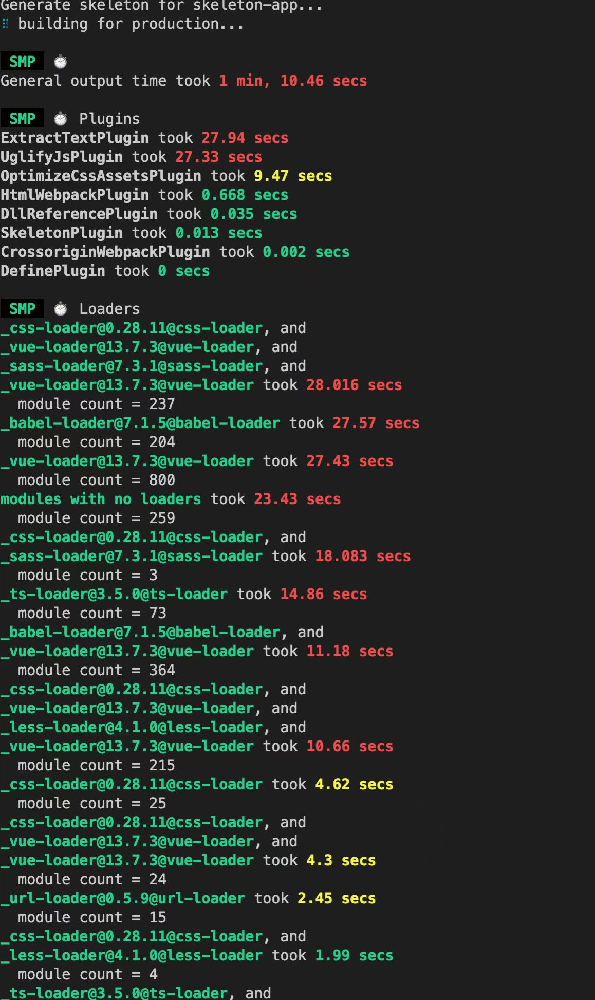
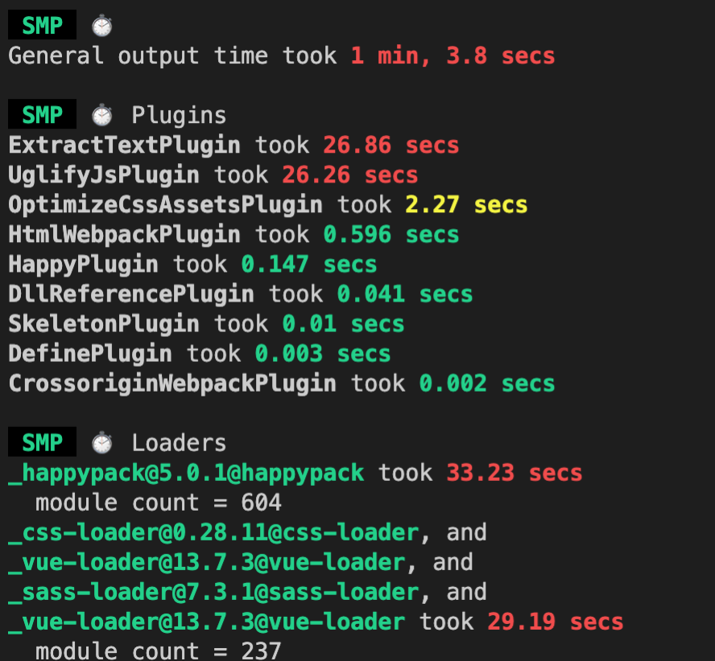
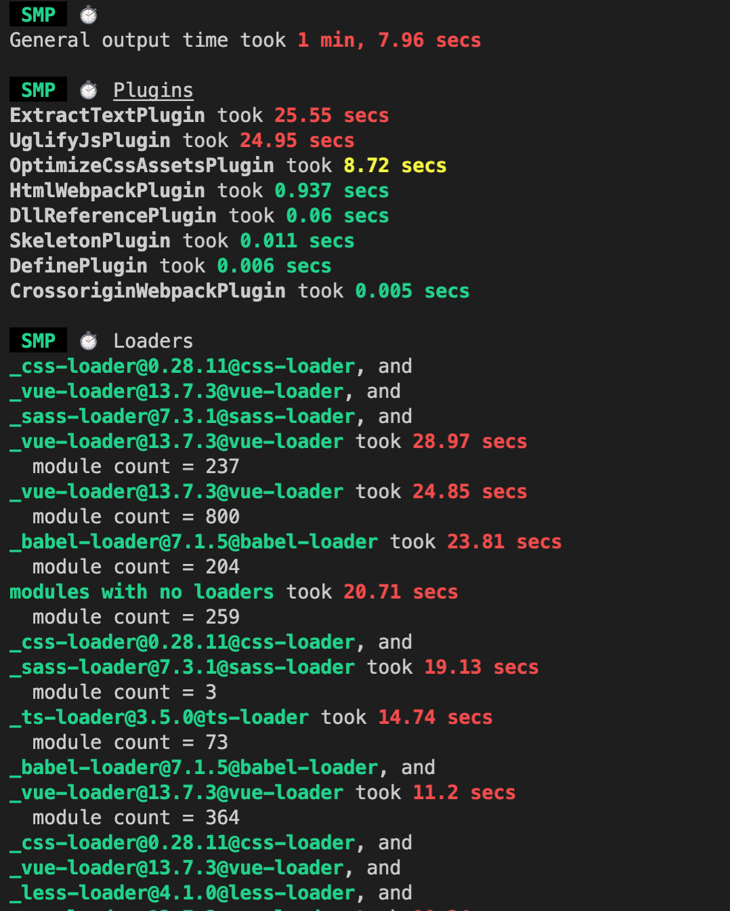
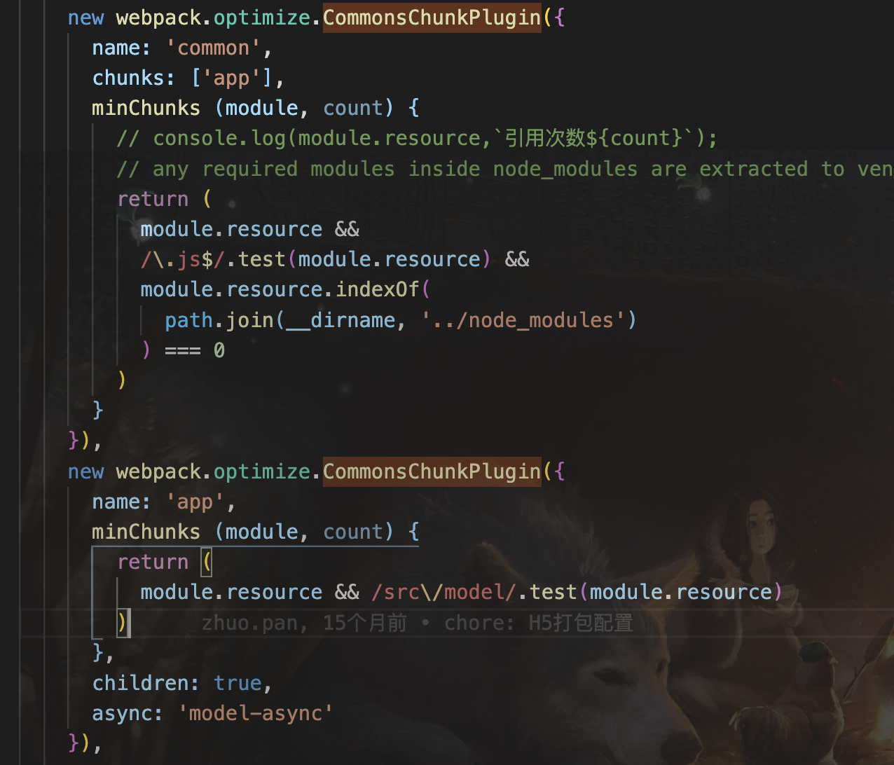

### 打包速度优化
1. speed-measure-webpack-plugin
> 作用： 用于查看各loader和plugin的运行时长，根据插件和loader的运行时长针对性去优化

- 使用：
```
const SpeedMeasurePlugin=require('speed-measure-webpack-plugin')
const smp = new SpeedMeasurePlugin();

module.exports = smp.wrap({
    <!-- webpack打包配置 -->
})
```

- 四合一项目webpack.prod.config.js运行图片



2.  loader配置优化
- 打包频率
    + exclude: /node_modules/
    + include: path.resolve(__dirname, '../src')只对src下的进行打包

- 开启babel-loader缓存配置，降低二次构建的时间
> 坑点：会将资源存放在浏览器cache的cache storage中，再次访问直接加载缓存中的资源，因此关掉启动项目，还是可以访问到页面
webpack4以下版本配置会有一定效果，webpack5的版本只是用cache配置效果更好

```
 <!-- babal-loader 缓存配置 -->

 {
   test:/\.(js)$/,
   exclude:/node_modules/,
   loader:'babel-loader',
   options:{
     presets:['@babel/preset-env'],
     cacheDirectory:true
    }
}
```
<!-- todo webpack5中如何配置cache -->


-  多线程提高构建速度

> 多线程提高构建速度，针对耗时较长的loader配置单独的worker池，可以同步其他loader构建
>> thread-loader 适用webpack5版本
>> happypack-plugin 适用于webpack3以下版本

+ 四合一项目-build开启happypack

```
1. happypack的配置
<!-- happypack的配置 -->
plugins: [
  new HappyPack({
    // 用id，来代表当前的HappyPack是用来处理一类特定的文件
    id: 'babel',
    // 如何处理.js文件，用法和Loader配置中一样
    loaders: [{
      path: 'babel-loader',
      cache: true,
    }],
    threadPool: HappyPackThreadPool,
  }),
  new HappyPack({
    // 用id，来代表当前的HappyPack是用来处理一类特定的文件
    id: 'vue',
    loaders: [
      {
        loader: 'vue-loader',
        options: {
          ...vueLoaderConfig,
          ts: [ 
            'ts-loader'
          ]
        }
      }
    ],
    threadPool: HappyPackThreadPool,
  }),
],


```

<!-- threadloader配置 -->

3: 通过配置 resolve module 减少打包时间
- symlinks
> 不使用npm link的情况下直接关掉会减少解析工作量 四合一项目关闭后打包时间减少两秒左右
```
module.exports = {
    resolve: {
        symlinks: false,
    },
}
```


- 减少查找过程
```
1. 配置文件查找顺序的优先级,页面脚本引入文件时不写后缀时更快查找
resolve: {extension: ['js', 'jsx']}
2. 设置文件夹默认默认入口文件,减少搜索步骤
resolve: {mainFiles: ['index']}    
```
- 配置无需解析的模块但会被打包到最终的bundle中
```
module: {
    // 配置无需解析的模块
    noParse: [/vue\.min\.js$]
}
```

### 前端性能优化
1. 公用代码抽离
>   wp3以下： CommonsChunkPlugin
>   wp4以上： SplitChunksPlugin


<!-- todo 配一张四合一项目使用commonChunkPlugin的效果时间图 -->
-  CommonsChunkPlugin 
    > 避免首屏bundle文件过大，减少加载时长

```
entry配置的入口： entry chunk
child chunk：入口a依赖文件b  b为 child chunk
common chunk: 插件分离的公共chunk  
参数说明：
name：合并/创建的chunk名字

filename：指定commons chunk的文件名

chunks：指定从哪些chunk当中去找公共模块，默认是entry chunks

minChunks：数字 、 inifinity（3） 、函数 ：模块满足条件会被提取成公共chunk

children： 通过entry chunk 切割的children chunk作为 source chunk （细化抽离的范围）

async: 配合children属性 用于生产新的common chunk 当 children chunk被加载时异步加载
```



- splitChunks

    > 解决了入口文件过大的问题还能有效自动化的解决懒加载模块之间的代码重复问题

```
module.exports = {
  splitChunks: {
    // include all types of chunks
    chunks: "all",
    // 重复打包问题
    cacheGroups: {
      vendors: {
        // node_modules里的代码
        test: /[\\/]node_modules[\\/]/,
        chunks: "all",
        // name: 'vendors', 一定不要定义固定的name
        priority: 10, // 优先级
        enforce: true,
      },
    },
  },
};
```

2. 第三方类库使用cdn

- externals

>   开发npm包时  将一些项目中依赖的包如 axios vue 这些加入这个置  不进行打包处理 减少bundle体积

```
externals: {  
  jquery:'jQuery',
},
```
> 
### source map 

### 文件hash值


<a src="https://juejin.cn/post/7127303956400701470"></a>
https://zhuanlan.zhihu.com/p/406222865
https://blog.csdn.net/lin_fightin/article/details/115494427

<!-- CommonsChunkPlugin -->
https://segmentfault.com/a/1190000012828879